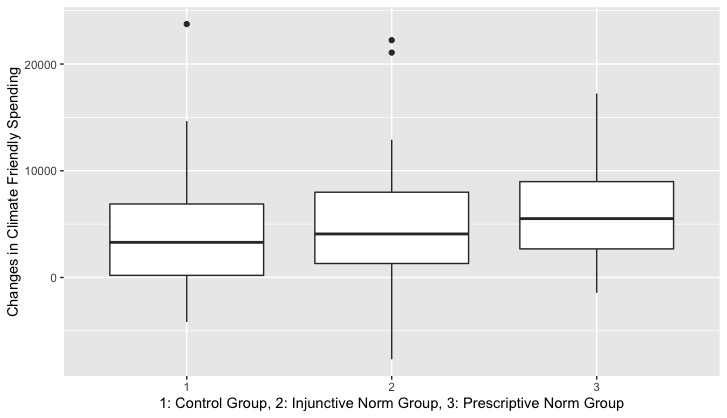
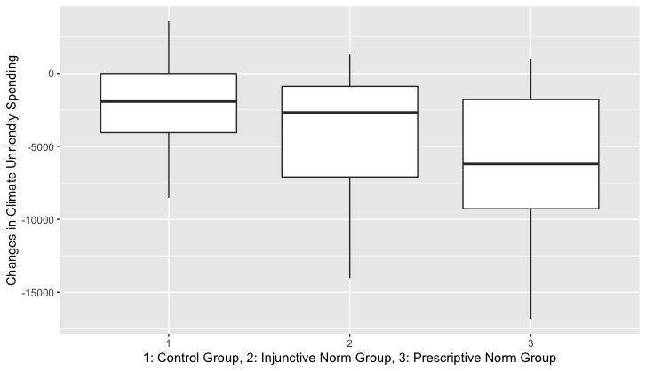

The data analysis part; the Experimental Methods
================

This is an R markdown for the data analysis part of the final term paper
for the module ‘Experimental Methods’.

(Chapter 4 of the term paper)

Based on the experiment design, a mock data has been provided.

In order to take a deeper look, we import libraries and the data file.

``` r
library(readxl)
library(tidyverse)
```

    ## ── Attaching packages ─────────────────────────────────────── tidyverse 1.3.1 ──

    ## ✓ ggplot2 3.3.5     ✓ purrr   0.3.4
    ## ✓ tibble  3.1.2     ✓ dplyr   1.0.6
    ## ✓ tidyr   1.1.3     ✓ stringr 1.4.0
    ## ✓ readr   1.4.0     ✓ forcats 0.5.1

    ## ── Conflicts ────────────────────────────────────────── tidyverse_conflicts() ──
    ## x dplyr::filter() masks stats::filter()
    ## x dplyr::lag()    masks stats::lag()

``` r
library(plyr)
```

    ## ------------------------------------------------------------------------------

    ## You have loaded plyr after dplyr - this is likely to cause problems.
    ## If you need functions from both plyr and dplyr, please load plyr first, then dplyr:
    ## library(plyr); library(dplyr)

    ## ------------------------------------------------------------------------------

    ## 
    ## Attaching package: 'plyr'

    ## The following objects are masked from 'package:dplyr':
    ## 
    ##     arrange, count, desc, failwith, id, mutate, rename, summarise,
    ##     summarize

    ## The following object is masked from 'package:purrr':
    ## 
    ##     compact

``` r
library(ggplot2)
library(stargazer)
```

    ## 
    ## Please cite as:

    ##  Hlavac, Marek (2018). stargazer: Well-Formatted Regression and Summary Statistics Tables.

    ##  R package version 5.2.2. https://CRAN.R-project.org/package=stargazer

``` r
normdf <- read_excel("normdf.xlsx")

dim(normdf)
```

    ## [1] 120  14

``` r
head(normdf)
```

    ## # A tibble: 6 x 14
    ##   Complex Treatment NumberFamily NumberCars BaselineBike BaselineClimate
    ##     <dbl>     <dbl>        <dbl>      <dbl>        <dbl>           <dbl>
    ## 1       2         1            2          1            1               4
    ## 2       3         2            3          1            0               1
    ## 3       4         2            3          2            0               3
    ## 4       5         3            4          1            0               4
    ## 5       6         3            2          3            0               4
    ## 6       1         1            2          2            0               2
    ## # … with 8 more variables: PostCars <dbl>, PostBike <dbl>, PostClimate <dbl>,
    ## #   SeenInfo <dbl>, BaselineSpendingFriendly <dbl>,
    ## #   BaselineSpendingUnfriendly <dbl>, PostSpendingFriendly <dbl>,
    ## #   PostSpendingUnfriendly <dbl>

The data contains the output variables (pre/post spending on climate
friendly/unfriendly transport) and control variables.

We need to delete the column ‘Complex’ which is not necessary in this
analysis. On top of that, for the modeling we make two more columns of
dummy variable for the treatment groups.

``` r
## Drop the column 'Complex' which is not necessary in this analysis
normdf$Complex <- NULL

## defining categorical variables
## treatment 2 means an injunctive norms provision
## treatment 3 means a descriptive norms provision
normdf$InjunctiveNorms <- ifelse(normdf$Treatment  == 2, 1, 0)
normdf$DescriptiveNorms <- ifelse(normdf$Treatment  == 3, 1, 0)
dim(normdf)
```

    ## [1] 120  15

**1. Determinants of transport usage**

Firstly, we conduct OLS regression on baseline spending data.

``` r
## Run a regression of two spendings on control variables
Model_PreUnfriendly <- lm(BaselineSpendingUnfriendly ~ NumberFamily + NumberCars + BaselineBike + BaselineClimate, data = normdf)
Model_PreFriendly <- lm(BaselineSpendingFriendly ~ NumberFamily + NumberCars + BaselineBike + BaselineClimate, data = normdf)

summary(Model_PreUnfriendly)
```

    ## 
    ## Call:
    ## lm(formula = BaselineSpendingUnfriendly ~ NumberFamily + NumberCars + 
    ##     BaselineBike + BaselineClimate, data = normdf)
    ## 
    ## Residuals:
    ##      Min       1Q   Median       3Q      Max 
    ## -15024.8  -3408.9   -156.9   3691.2  11280.4 
    ## 
    ## Coefficients:
    ##                 Estimate Std. Error t value Pr(>|t|)    
    ## (Intercept)       7341.6     2122.6   3.459 0.000762 ***
    ## NumberFamily       337.3      544.9   0.619 0.537159    
    ## NumberCars        2777.9      553.4   5.020 1.91e-06 ***
    ## BaselineBike     -1679.3     1127.8  -1.489 0.139222    
    ## BaselineClimate   -987.8      464.5  -2.126 0.035604 *  
    ## ---
    ## Signif. codes:  0 '***' 0.001 '**' 0.01 '*' 0.05 '.' 0.1 ' ' 1
    ## 
    ## Residual standard error: 5229 on 115 degrees of freedom
    ## Multiple R-squared:  0.2654, Adjusted R-squared:  0.2399 
    ## F-statistic: 10.39 on 4 and 115 DF,  p-value: 3.217e-07

``` r
summary(Model_PreFriendly)
```

    ## 
    ## Call:
    ## lm(formula = BaselineSpendingFriendly ~ NumberFamily + NumberCars + 
    ##     BaselineBike + BaselineClimate, data = normdf)
    ## 
    ## Residuals:
    ##    Min     1Q Median     3Q    Max 
    ## -24701  -4191   1156   5016  19405 
    ## 
    ## Coefficients:
    ##                 Estimate Std. Error t value Pr(>|t|)    
    ## (Intercept)      18865.6     3303.5   5.711 8.95e-08 ***
    ## NumberFamily       467.6      848.1   0.551   0.5824    
    ## NumberCars       -1558.7      861.3  -1.810   0.0729 .  
    ## BaselineBike      3179.0     1755.3   1.811   0.0727 .  
    ## BaselineClimate    937.5      723.0   1.297   0.1973    
    ## ---
    ## Signif. codes:  0 '***' 0.001 '**' 0.01 '*' 0.05 '.' 0.1 ' ' 1
    ## 
    ## Residual standard error: 8138 on 115 degrees of freedom
    ## Multiple R-squared:  0.08671,    Adjusted R-squared:  0.05494 
    ## F-statistic: 2.729 on 4 and 115 DF,  p-value: 0.03252

The baseline spending models indicate that the households that have a
more skeptical point of view towards climate change (p &lt; 0.05) and
own more automobiles (p &lt; 0.01) tend to choose climate unfriendly
transportation. The households who answered that they see the climate
issue as less serious (who opt for 1: not serious at all and 2, out of
range 4: very serious) owned more cars (mean: 1.49) than the other group
(mean: 1.19) on average. We find that the number of cars owned and the
sharing bike membership have a relation with the climate-friendly
transport usage, though it was not significant.

**2. Determinants of the post-intervention transport usage**

We implement the same process on the post-experiment data. However for
the post-intervention analysis, we only take the households that were
exposed to the information into the treatment group observations. In
addition, we excluded participants from the control group who answered
that they have seen the information. This adjustment left us 99
observations out of 120.

``` r
## Adding the changes in spending for the next analysis
normdf$deltaUnfriendly <- normdf$PostSpendingUnfriendly - normdf$BaselineSpendingUnfriendly
normdf$deltaFriendly <- normdf$PostSpendingFriendly - normdf$BaselineSpendingFriendly

df_seeninfo <- normdf

## Remove observations who did not participate the post-survey
df_seeninfo <- drop_na(df_seeninfo)

## drop the observations 
## who answered that they could not see the information 
## among the treatment groups

df_seeninfo <- df_seeninfo[!(df_seeninfo$Treatment == 2 & df_seeninfo$SeenInfo == 0), ]
df_seeninfo <- df_seeninfo[!(df_seeninfo$Treatment == 3 & df_seeninfo$SeenInfo == 0), ]
df_seeninfo <- df_seeninfo[!(df_seeninfo$Treatment == 1 & df_seeninfo$SeenInfo == 1), ]


dim(df_seeninfo)
```

    ## [1] 99 17

``` r
head(df_seeninfo)
```

    ## # A tibble: 6 x 17
    ##   Treatment NumberFamily NumberCars BaselineBike BaselineClimate PostCars
    ##       <dbl>        <dbl>      <dbl>        <dbl>           <dbl>    <dbl>
    ## 1         1            2          1            1               4        1
    ## 2         2            3          1            0               1        1
    ## 3         2            3          2            0               3        2
    ## 4         3            4          1            0               4        1
    ## 5         3            2          3            0               4        3
    ## 6         1            2          2            0               2        2
    ## # … with 11 more variables: PostBike <dbl>, PostClimate <dbl>, SeenInfo <dbl>,
    ## #   BaselineSpendingFriendly <dbl>, BaselineSpendingUnfriendly <dbl>,
    ## #   PostSpendingFriendly <dbl>, PostSpendingUnfriendly <dbl>,
    ## #   InjunctiveNorms <dbl>, DescriptiveNorms <dbl>, deltaUnfriendly <dbl>,
    ## #   deltaFriendly <dbl>

``` r
## linear regression of post-spendings on variables including the interventions
Model_info_PostUnfriendly <- lm(PostSpendingUnfriendly ~ InjunctiveNorms + DescriptiveNorms + NumberFamily + PostCars + PostBike + PostClimate, data = df_seeninfo)
Model_info_PostFriendly <- lm(PostSpendingFriendly ~ InjunctiveNorms + DescriptiveNorms + NumberFamily + PostCars + PostBike + PostClimate, data = df_seeninfo)

summary(Model_info_PostUnfriendly)
```

    ## 
    ## Call:
    ## lm(formula = PostSpendingUnfriendly ~ InjunctiveNorms + DescriptiveNorms + 
    ##     NumberFamily + PostCars + PostBike + PostClimate, data = df_seeninfo)
    ## 
    ## Residuals:
    ##     Min      1Q  Median      3Q     Max 
    ## -8301.3 -2647.9  -190.1  2348.1 11346.8 
    ## 
    ## Coefficients:
    ##                  Estimate Std. Error t value Pr(>|t|)    
    ## (Intercept)        5458.9     1891.8   2.886  0.00487 ** 
    ## InjunctiveNorms   -2545.9      952.3  -2.673  0.00889 ** 
    ## DescriptiveNorms  -3018.0      961.9  -3.138  0.00229 ** 
    ## NumberFamily        195.4      434.8   0.450  0.65412    
    ## PostCars           2580.3      435.0   5.932  5.2e-08 ***
    ## PostBike          -2293.3      935.2  -2.452  0.01609 *  
    ## PostClimate       -1037.9      499.6  -2.077  0.04055 *  
    ## ---
    ## Signif. codes:  0 '***' 0.001 '**' 0.01 '*' 0.05 '.' 0.1 ' ' 1
    ## 
    ## Residual standard error: 3866 on 92 degrees of freedom
    ## Multiple R-squared:  0.4223, Adjusted R-squared:  0.3847 
    ## F-statistic: 11.21 on 6 and 92 DF,  p-value: 2.323e-09

``` r
summary(Model_info_PostFriendly)
```

    ## 
    ## Call:
    ## lm(formula = PostSpendingFriendly ~ InjunctiveNorms + DescriptiveNorms + 
    ##     NumberFamily + PostCars + PostBike + PostClimate, data = df_seeninfo)
    ## 
    ## Residuals:
    ##      Min       1Q   Median       3Q      Max 
    ## -15553.5  -3789.5     48.4   4027.8  11295.7 
    ## 
    ## Coefficients:
    ##                  Estimate Std. Error t value Pr(>|t|)    
    ## (Intercept)       23803.1     2735.7   8.701 1.23e-13 ***
    ## InjunctiveNorms    1634.9     1377.2   1.187  0.23823    
    ## DescriptiveNorms   2747.1     1391.0   1.975  0.05127 .  
    ## NumberFamily       -401.3      628.7  -0.638  0.52490    
    ## PostCars          -1876.6      629.0  -2.983  0.00365 ** 
    ## PostBike           4365.5     1352.5   3.228  0.00173 ** 
    ## PostClimate        1592.6      722.5   2.204  0.03000 *  
    ## ---
    ## Signif. codes:  0 '***' 0.001 '**' 0.01 '*' 0.05 '.' 0.1 ' ' 1
    ## 
    ## Residual standard error: 5591 on 92 degrees of freedom
    ## Multiple R-squared:  0.2851, Adjusted R-squared:  0.2385 
    ## F-statistic: 6.116 on 6 and 92 DF,  p-value: 2.009e-05

We find a significant impact of the intervention on the post-treatment
data. As we can see in the result of the post-spending models, both of
the treatment groups reduced their spending on less-environmental travel
options. The effect was slightly larger on the cohort who received
descriptive norm information(- 3,018 KRW) than injunctive norm
information (- 2,545 KRW). Climate change perception turned out to be a
still significant determinant (p &lt; 0.05). However, norm provision was
not a prominent factor to change the perception itself. Only 1 household
answered that she perceives the issue more seriously than before (from 1
to 2).

Among the determinants, bike-sharing membership has the strongest
correlation (4,365 KRW) with environmental travel spending. In other
words, households that have more options on climate-friendly transport
than one have less spend more on it.

**3. Changes in spending**

``` r
## Spending changes and the intervention
Model_info_deltaUnfriendly <- lm(deltaUnfriendly ~ InjunctiveNorms + DescriptiveNorms, data = df_seeninfo)
Model_info_deltaFriendly <- lm(deltaFriendly ~ InjunctiveNorms + DescriptiveNorms, data = df_seeninfo)

summary(Model_info_deltaUnfriendly)
```

    ## 
    ## Call:
    ## lm(formula = deltaUnfriendly ~ InjunctiveNorms + DescriptiveNorms, 
    ##     data = df_seeninfo)
    ## 
    ## Residuals:
    ##      Min       1Q   Median       3Q      Max 
    ## -10630.3  -2449.8    577.9   3005.9   7194.7 
    ## 
    ## Coefficients:
    ##                  Estimate Std. Error t value Pr(>|t|)    
    ## (Intercept)       -2082.7      679.7  -3.064  0.00283 ** 
    ## InjunctiveNorms   -1955.2      975.7  -2.004  0.04789 *  
    ## DescriptiveNorms  -4111.0      991.7  -4.145 7.32e-05 ***
    ## ---
    ## Signif. codes:  0 '***' 0.001 '**' 0.01 '*' 0.05 '.' 0.1 ' ' 1
    ## 
    ## Residual standard error: 4021 on 96 degrees of freedom
    ## Multiple R-squared:  0.1518, Adjusted R-squared:  0.1342 
    ## F-statistic: 8.592 on 2 and 96 DF,  p-value: 0.0003692

``` r
summary(Model_info_deltaFriendly)
```

    ## 
    ## Call:
    ## lm(formula = deltaFriendly ~ InjunctiveNorms + DescriptiveNorms, 
    ##     data = df_seeninfo)
    ## 
    ## Residuals:
    ##      Min       1Q   Median       3Q      Max 
    ## -13161.1  -4035.8   -632.2   2661.4  19466.5 
    ## 
    ## Coefficients:
    ##                  Estimate Std. Error t value Pr(>|t|)    
    ## (Intercept)        4278.5      950.6   4.501  1.9e-05 ***
    ## InjunctiveNorms    1218.5     1364.5   0.893    0.374    
    ## DescriptiveNorms   1842.7     1387.0   1.329    0.187    
    ## ---
    ## Signif. codes:  0 '***' 0.001 '**' 0.01 '*' 0.05 '.' 0.1 ' ' 1
    ## 
    ## Residual standard error: 5624 on 96 degrees of freedom
    ## Multiple R-squared:  0.01892,    Adjusted R-squared:  -0.001515 
    ## F-statistic: 0.9259 on 2 and 96 DF,  p-value: 0.3997

For both treatment groups, the parameters were positive but not
significant in the climate-friendly spending change model. On the other
hand, we can find the effect of the intervention on less environmentally
friendly spending. Both parameters indicating the effect of the
treatment were significant (p &lt; 0.05 and p &lt; 0.01 respectively). A
diminishing in the descriptive norm group is even steeper (-4,110 KRW)
than the other treatment group (-1,955 KRW) in contrast to several
previous studies.

``` r
## boxplot for changes in spending
df_seeninfo$TreatmentFactor <- factor(df_seeninfo$Treatment)
ggplot(df_seeninfo, aes(x=TreatmentFactor, y=deltaFriendly)) + geom_boxplot() + labs(y = "Changes in Climate Friendly Spending", x = "1: Control Group, 2: Injunctive Norm Group, 3: Prescriptive Norm Group")
```

<!-- -->

``` r
ggplot(df_seeninfo, aes(x=TreatmentFactor, y=deltaUnfriendly)) + geom_boxplot() + labs(y = "Changes in Climate Unriendly Spending", x = "1: Control Group, 2: Injunctive Norm Group, 3: Prescriptive Norm Group")
```

<!-- -->

This switch of transport choice is visually depicted in the above
boxplots.
